# HRMS API — Admin Route Hierarchy

> All routes are prefixed with **`/api/v1`**
> Roles: `admin` | `hr` | `employee`
> Routes marked with a lock require authentication. Routes marked with a shield require admin/hr role.

---

## 1. Complete API Tree (Mermaid)

```mermaid
graph TD
    ROOT["/api/v1"] --> HEALTH["/health — GET"]
    ROOT --> AUTH["/auth"]
    ROOT --> ADMIN["/admin"]
    ROOT --> ATT["/attendance"]
    ROOT --> EMP["/employees"]
    ROOT --> PROFILE["/profile"]
    ROOT --> TASKS["/tasks"]
    ROOT --> CHAT["/chat"]
    ROOT --> LEAVES["/leaves"]
    ROOT --> ANN["/announcements"]
    ROOT --> NOTIF["/notifications"]
    ROOT --> PAYROLL["/payroll"]
    ROOT --> UPLOADS["/uploads"]
    ROOT --> CONFIG["/config"]

    style ROOT fill:#1a1a2e,color:#fff,stroke:#e94560
    style HEALTH fill:#16213e,color:#fff
    style AUTH fill:#0f3460,color:#fff
    style ADMIN fill:#e94560,color:#fff
    style ATT fill:#0f3460,color:#fff
    style EMP fill:#0f3460,color:#fff
    style PROFILE fill:#0f3460,color:#fff
    style TASKS fill:#0f3460,color:#fff
    style CHAT fill:#0f3460,color:#fff
    style LEAVES fill:#0f3460,color:#fff
    style ANN fill:#0f3460,color:#fff
    style NOTIF fill:#0f3460,color:#fff
    style PAYROLL fill:#0f3460,color:#fff
    style UPLOADS fill:#0f3460,color:#fff
    style CONFIG fill:#0f3460,color:#fff
```

---

## 2. Auth Module — Public Routes

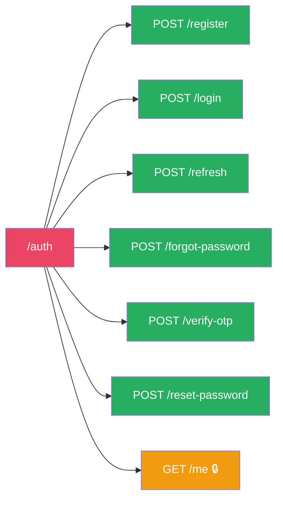

---

## 3. Admin Module — Admin & HR Only

```mermaid
graph TD
    ADMIN["/admin 🛡️"]

    ADMIN --> DASH["GET /dashboard"]
    ADMIN --> ACT["GET /activity"]
    ADMIN --> DEPT["GET /departments"]
    ADMIN --> DDW["GET /doc-deadline-warnings"]
    ADMIN --> SELFIE["GET /punch-selfies?date="]

    ADMIN --> OS_GET["GET /office-settings"]
    ADMIN --> OS_PUT["PUT /office-settings 👑"]

    ADMIN --> AS_GET["GET /attendance-settings"]
    ADMIN --> AS_PUT["PUT /attendance-settings 👑"]

    ADMIN --> PS_GET["GET /payroll-period-settings"]
    ADMIN --> PS_PUT["PUT /payroll-period-settings 👑"]

    style ADMIN fill:#e94560,color:#fff,stroke-width:3px
    style DASH fill:#3498db,color:#fff
    style ACT fill:#3498db,color:#fff
    style DEPT fill:#3498db,color:#fff
    style DDW fill:#3498db,color:#fff
    style SELFIE fill:#3498db,color:#fff
    style OS_GET fill:#3498db,color:#fff
    style OS_PUT fill:#c0392b,color:#fff
    style AS_GET fill:#3498db,color:#fff
    style AS_PUT fill:#c0392b,color:#fff
    style PS_GET fill:#3498db,color:#fff
    style PS_PUT fill:#c0392b,color:#fff
```

> **Legend:** Blue = admin + hr | Red = admin only

---

## 4. Attendance Module

```mermaid
graph TD
    ATT["/attendance 🔒"]

    subgraph "Employee Self-Service"
        PI["POST /punch-in"]
        PO["POST /punch-out"]
        BS["POST /break/start"]
        BE["POST /break/end"]
        TD["GET /today"]
        MO["GET /monthly"]
        RS["GET /repunch-status"]
        AS["POST /activity-status"]
    end

    subgraph "Admin & HR"
        ME["GET /monthly/:empId"]
        REG["PUT /regularize/:id 🛡️"]
        RPR["GET /repunch-requests 🛡️"]
        ACS["GET /activity-statuses 🛡️"]
    end

    subgraph "Admin Only 👑"
        RPA["PATCH /repunch-requests/:id/approve"]
        RPJ["PATCH /repunch-requests/:id/reject"]
    end

    ATT --> PI
    ATT --> PO
    ATT --> BS
    ATT --> BE
    ATT --> TD
    ATT --> MO
    ATT --> RS
    ATT --> AS
    ATT --> ME
    ATT --> REG
    ATT --> RPR
    ATT --> ACS
    ATT --> RPA
    ATT --> RPJ

    style ATT fill:#e94560,color:#fff,stroke-width:3px
    style REG fill:#e67e22,color:#fff
    style RPR fill:#e67e22,color:#fff
    style ACS fill:#e67e22,color:#fff
    style RPA fill:#c0392b,color:#fff
    style RPJ fill:#c0392b,color:#fff
```

---

## 5. Employees Module

```mermaid
graph TD
    EMP["/employees 🔒"]

    subgraph "Read — Any Authenticated"
        STATS["GET /stats"]
        PEND["GET /pending-approvals"]
        LIST["GET /"]
        DETAIL["GET /:id"]
        DOCS["GET /:id/documents"]
    end

    subgraph "Admin & HR — Write"
        CREATE["POST /"]
        UPDATE["PUT /:id"]
        DOCKEY["POST /:id/documents/by-key"]
        DOCUP["POST /:id/documents"]
        DOCDEL["DELETE /documents/:docId"]
        DOCDET["GET /:id/document-details"]
    end

    subgraph "Admin Only 👑"
        DEL["DELETE /:id"]
        FORCE["POST /:id/force-logout"]
        APPROVE["PUT /:id/approve"]
        REJECT["PUT /:id/reject"]
    end

    EMP --> STATS
    EMP --> PEND
    EMP --> LIST
    EMP --> DETAIL
    EMP --> DOCS
    EMP --> CREATE
    EMP --> UPDATE
    EMP --> DOCKEY
    EMP --> DOCUP
    EMP --> DOCDEL
    EMP --> DOCDET
    EMP --> DEL
    EMP --> FORCE
    EMP --> APPROVE
    EMP --> REJECT

    style EMP fill:#e94560,color:#fff,stroke-width:3px
    style CREATE fill:#e67e22,color:#fff
    style UPDATE fill:#e67e22,color:#fff
    style DOCKEY fill:#e67e22,color:#fff
    style DOCUP fill:#e67e22,color:#fff
    style DOCDEL fill:#e67e22,color:#fff
    style DOCDET fill:#e67e22,color:#fff
    style DEL fill:#c0392b,color:#fff
    style FORCE fill:#c0392b,color:#fff
    style APPROVE fill:#c0392b,color:#fff
    style REJECT fill:#c0392b,color:#fff
```

---

## 6. Profile Module

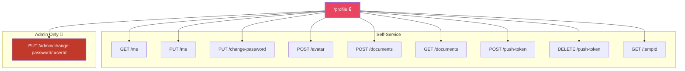

---

## 7. Tasks Module

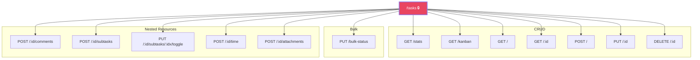

---

## 8. Chat Module

```mermaid
graph TD
    CHAT["/chat 🔒"]

    subgraph "Conversations"
        LIST["GET /"]
        DIRECT["POST /direct"]
        GCRT["POST /groups"]
        ONLINE["GET /online"]
        SEARCH["GET /search"]
        STAR["GET /starred"]
    end

    subgraph "Conversation Resources"
        MEDIA["GET /:convId/media"]
        PINNED["GET /:convId/pinned"]
        MSGS["GET /:convId/messages"]
        SEND["POST /:convId/messages"]
        UPLOAD["POST /:convId/upload"]
    end

    subgraph "Group Management"
        GUPD["PUT /groups/:convId"]
        GADD["POST /groups/:convId/members"]
        GREM["DELETE /groups/:convId/members/:empId"]
    end

    subgraph "Message Actions"
        MEDIT["PUT /messages/:msgId"]
        MDEL["DELETE /messages/:msgId"]
        REACT["POST /messages/:msgId/reactions"]
        PIN["PUT /messages/:msgId/pin"]
        MSTAR["PUT /messages/:msgId/star"]
    end

    CHAT --> LIST
    CHAT --> DIRECT
    CHAT --> GCRT
    CHAT --> ONLINE
    CHAT --> SEARCH
    CHAT --> STAR
    CHAT --> MEDIA
    CHAT --> PINNED
    CHAT --> MSGS
    CHAT --> SEND
    CHAT --> UPLOAD
    CHAT --> GUPD
    CHAT --> GADD
    CHAT --> GREM
    CHAT --> MEDIT
    CHAT --> MDEL
    CHAT --> REACT
    CHAT --> PIN
    CHAT --> MSTAR

    style CHAT fill:#e94560,color:#fff,stroke-width:3px
```

---

## 9. Leaves Module

```mermaid
graph TD
    LEAVES["/leaves 🔒"]

    subgraph "Employee Self-Service"
        LIST["GET / — list"]
        APPLY["POST / — apply"]
        MY["GET /my"]
        BAL["GET /balance"]
        WD["PATCH /:id/withdraw"]
        CAN["PATCH /:id/cancel"]
        REPLY["POST /:id/question/:qid/reply"]
        ATCH["POST /:id/attachment"]
    end

    subgraph "Admin & HR 🛡️"
        BALE["GET /balance/:empId"]
        SUM["GET /summary"]
        PEND["GET /pending"]
        ALL["GET /all"]
        APR["PATCH /:id/approve"]
        REJ["PATCH /:id/reject"]
        ACAN["PATCH /:id/admin-cancel"]
        QUES["POST /:id/question"]
    end

    LEAVES --> LIST
    LEAVES --> APPLY
    LEAVES --> MY
    LEAVES --> BAL
    LEAVES --> WD
    LEAVES --> CAN
    LEAVES --> REPLY
    LEAVES --> ATCH
    LEAVES --> BALE
    LEAVES --> SUM
    LEAVES --> PEND
    LEAVES --> ALL
    LEAVES --> APR
    LEAVES --> REJ
    LEAVES --> ACAN
    LEAVES --> QUES

    style LEAVES fill:#e94560,color:#fff,stroke-width:3px
    style BALE fill:#e67e22,color:#fff
    style SUM fill:#e67e22,color:#fff
    style PEND fill:#e67e22,color:#fff
    style ALL fill:#e67e22,color:#fff
    style APR fill:#e67e22,color:#fff
    style REJ fill:#e67e22,color:#fff
    style ACAN fill:#e67e22,color:#fff
    style QUES fill:#e67e22,color:#fff
```

---

## 10. Announcements Module

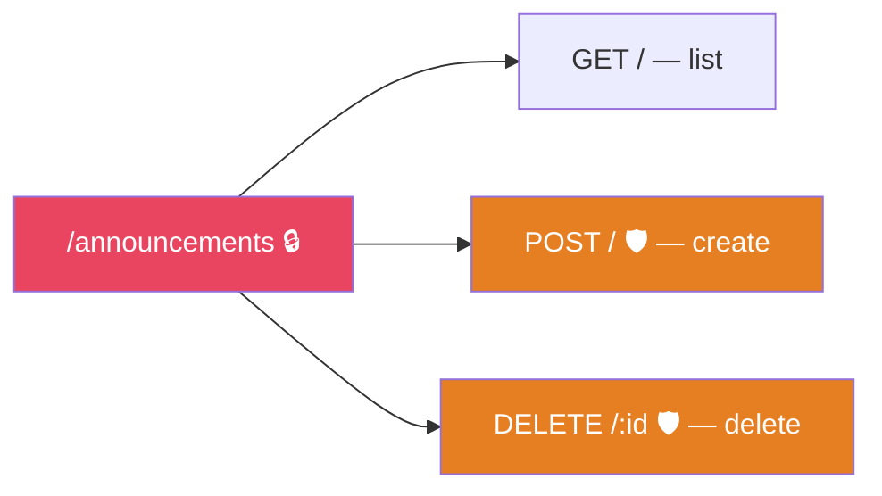

---

## 11. Notifications Module

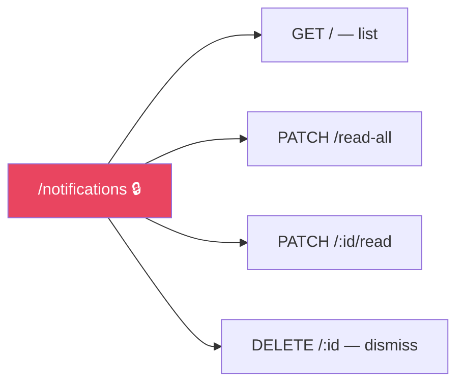

---

## 12. Payroll Module

```mermaid
graph TD
    PAY["/payroll 🔒"]

    subgraph "Employee Self-Service"
        MY["GET /my — my slips"]
        PDF["GET /:id/pdf"]
    end

    subgraph "Admin & HR — Read"
        ECFG["GET /employee/:empId/config"]
        EREV["GET /employee/:empId/revisions"]
        IFSC["GET /ifsc/:code"]
        SLIST["GET / — list slips"]
        SDET["GET /:id — slip detail"]
        LATE["GET /:id/late-details"]
    end

    subgraph "Admin & HR — Write"
        ECFGU["PATCH /employee/:empId/config"]
    end

    subgraph "Admin Only 👑"
        GEN["POST /generate"]
        IMP["POST /import-excel"]
        FINA["POST /finalize-all"]
        BFIN["POST /bulk-finalize"]
        BPAY["POST /bulk-payment-date"]
        BDEL["DELETE /bulk-delete"]
        SPAT["PATCH /:id — update slip"]
        SDEL["DELETE /:id — delete slip"]
        SFIN["POST /:id/finalize"]
        ETPL["GET /export-template"]
        EBS["GET /export-bank-statement"]
        EEPF["GET /export-epfo"]
        EWD["GET /export-working-days"]
    end

    PAY --> MY
    PAY --> PDF
    PAY --> ECFG
    PAY --> EREV
    PAY --> IFSC
    PAY --> SLIST
    PAY --> SDET
    PAY --> LATE
    PAY --> ECFGU
    PAY --> GEN
    PAY --> IMP
    PAY --> FINA
    PAY --> BFIN
    PAY --> BPAY
    PAY --> BDEL
    PAY --> SPAT
    PAY --> SDEL
    PAY --> SFIN
    PAY --> ETPL
    PAY --> EBS
    PAY --> EEPF
    PAY --> EWD

    style PAY fill:#e94560,color:#fff,stroke-width:3px
    style ECFG fill:#3498db,color:#fff
    style EREV fill:#3498db,color:#fff
    style IFSC fill:#3498db,color:#fff
    style SLIST fill:#3498db,color:#fff
    style SDET fill:#3498db,color:#fff
    style LATE fill:#3498db,color:#fff
    style ECFGU fill:#e67e22,color:#fff
    style GEN fill:#c0392b,color:#fff
    style IMP fill:#c0392b,color:#fff
    style FINA fill:#c0392b,color:#fff
    style BFIN fill:#c0392b,color:#fff
    style BPAY fill:#c0392b,color:#fff
    style BDEL fill:#c0392b,color:#fff
    style SPAT fill:#c0392b,color:#fff
    style SDEL fill:#c0392b,color:#fff
    style SFIN fill:#c0392b,color:#fff
    style ETPL fill:#c0392b,color:#fff
    style EBS fill:#c0392b,color:#fff
    style EEPF fill:#c0392b,color:#fff
    style EWD fill:#c0392b,color:#fff
```

---

## 13. Uploads & Config Modules

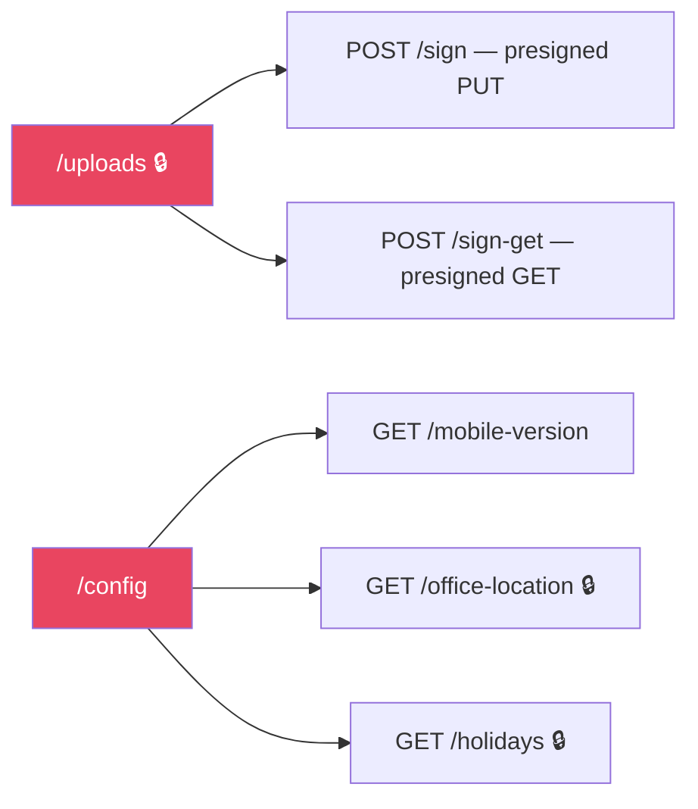

---

## 14. Admin-Only Routes — Full Summary

All routes that **exclusively require `admin` role** (not accessible to `hr` or `employee`):

```mermaid
graph TD
    CROWN["👑 ADMIN-ONLY ROUTES"]

    subgraph "Settings"
        S1["PUT /admin/office-settings"]
        S2["PUT /admin/attendance-settings"]
        S3["PUT /admin/payroll-period-settings"]
    end

    subgraph "Employee Management"
        E1["DELETE /employees/:id"]
        E2["POST /employees/:id/force-logout"]
        E3["PUT /employees/:id/approve"]
        E4["PUT /employees/:id/reject"]
    end

    subgraph "Attendance Approvals"
        A1["PATCH /attendance/repunch-requests/:id/approve"]
        A2["PATCH /attendance/repunch-requests/:id/reject"]
    end

    subgraph "Payroll Operations"
        P1["POST /payroll/generate"]
        P2["POST /payroll/import-excel"]
        P3["POST /payroll/finalize-all"]
        P4["POST /payroll/bulk-finalize"]
        P5["POST /payroll/bulk-payment-date"]
        P6["DELETE /payroll/bulk-delete"]
        P7["PATCH /payroll/:id"]
        P8["DELETE /payroll/:id"]
        P9["POST /payroll/:id/finalize"]
        P10["GET /payroll/export-template"]
        P11["GET /payroll/export-bank-statement"]
        P12["GET /payroll/export-epfo"]
        P13["GET /payroll/export-working-days"]
    end

    subgraph "User Security"
        U1["PUT /profile/admin/change-password/:userId"]
    end

    CROWN --> S1
    CROWN --> S2
    CROWN --> S3
    CROWN --> E1
    CROWN --> E2
    CROWN --> E3
    CROWN --> E4
    CROWN --> A1
    CROWN --> A2
    CROWN --> P1
    CROWN --> P2
    CROWN --> P3
    CROWN --> P4
    CROWN --> P5
    CROWN --> P6
    CROWN --> P7
    CROWN --> P8
    CROWN --> P9
    CROWN --> P10
    CROWN --> P11
    CROWN --> P12
    CROWN --> P13
    CROWN --> U1

    style CROWN fill:#c0392b,color:#fff,stroke-width:3px
    style S1 fill:#e74c3c,color:#fff
    style S2 fill:#e74c3c,color:#fff
    style S3 fill:#e74c3c,color:#fff
    style E1 fill:#e74c3c,color:#fff
    style E2 fill:#e74c3c,color:#fff
    style E3 fill:#e74c3c,color:#fff
    style E4 fill:#e74c3c,color:#fff
    style A1 fill:#e74c3c,color:#fff
    style A2 fill:#e74c3c,color:#fff
    style P1 fill:#e74c3c,color:#fff
    style P2 fill:#e74c3c,color:#fff
    style P3 fill:#e74c3c,color:#fff
    style P4 fill:#e74c3c,color:#fff
    style P5 fill:#e74c3c,color:#fff
    style P6 fill:#e74c3c,color:#fff
    style P7 fill:#e74c3c,color:#fff
    style P8 fill:#e74c3c,color:#fff
    style P9 fill:#e74c3c,color:#fff
    style P10 fill:#e74c3c,color:#fff
    style P11 fill:#e74c3c,color:#fff
    style P12 fill:#e74c3c,color:#fff
    style P13 fill:#e74c3c,color:#fff
    style U1 fill:#e74c3c,color:#fff
```

---

## 15. Role Access Matrix

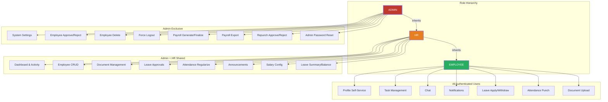

---

## Route Count Summary

| Module          | Total Routes | Public | Auth Only | Admin+HR | Admin Only |
|-----------------|:------------:|:------:|:---------:|:--------:|:----------:|
| Auth            |      7       |   6    |     1     |    —     |     —      |
| Admin           |     11       |   —    |     —     |    6     |     5      |
| Attendance      |     14       |   —    |     8     |    3     |     3      |
| Employees       |     15       |   —    |     5     |    6     |     4      |
| Profile         |     10       |   —    |     8     |    —     |     1      |
| Tasks           |     13       |   —    |    13     |    —     |     —      |
| Chat            |     18       |   —    |    18     |    —     |     —      |
| Leaves          |     16       |   —    |     8     |    8     |     —      |
| Announcements   |      3       |   —    |     1     |    2     |     —      |
| Notifications   |      4       |   —    |     4     |    —     |     —      |
| Payroll         |     22       |   —    |     2     |    6     |    14      |
| Uploads         |      2       |   —    |     2     |    —     |     —      |
| Config          |      3       |   1    |     2     |    —     |     —      |
| Health          |      1       |   1    |     —     |    —     |     —      |
| **TOTAL**       |  **139**     | **8**  |  **72**   |  **31** |   **27**   |

---

## Color Legend

| Color | Meaning |
|-------|---------|
| 🔴 Red (`#c0392b`) | Admin-only routes |
| 🟠 Orange (`#e67e22`) | Admin + HR routes |
| 🔵 Blue (`#3498db`) | Admin + HR read-only |
| 🟢 Green (`#27ae60`) | Public / any authenticated |
| 🟡 Yellow (`#f39c12`) | Auth-required self-service |
